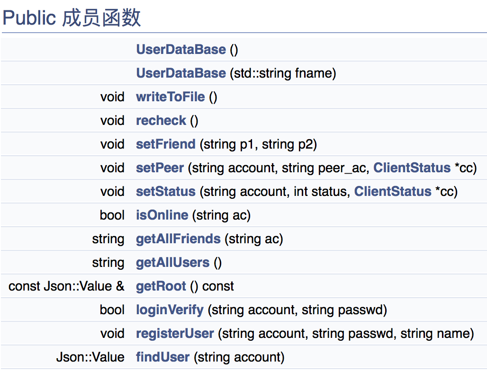
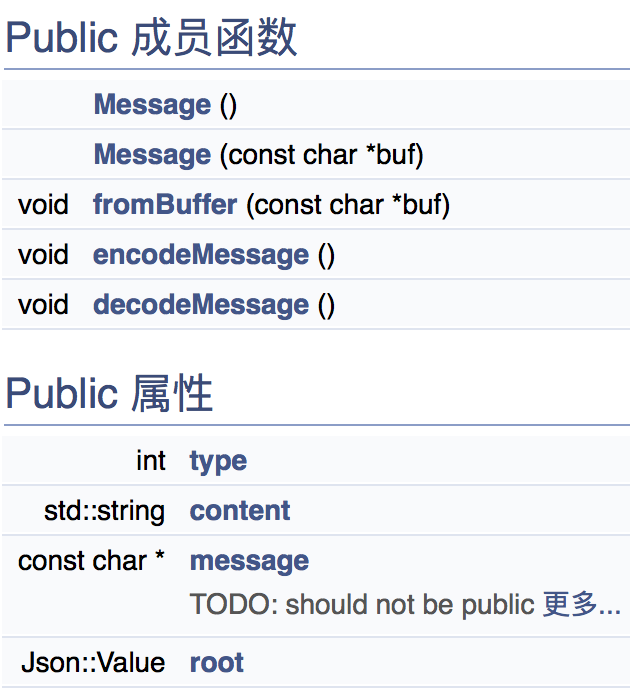
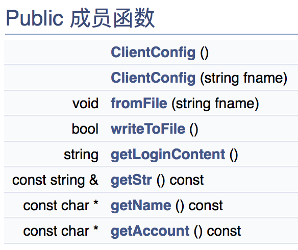
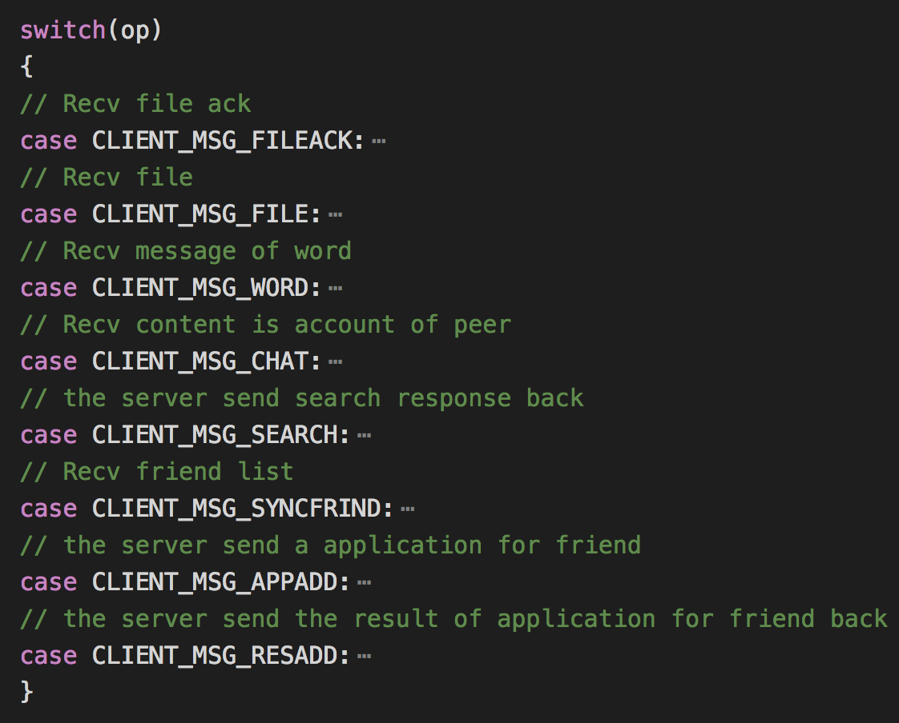
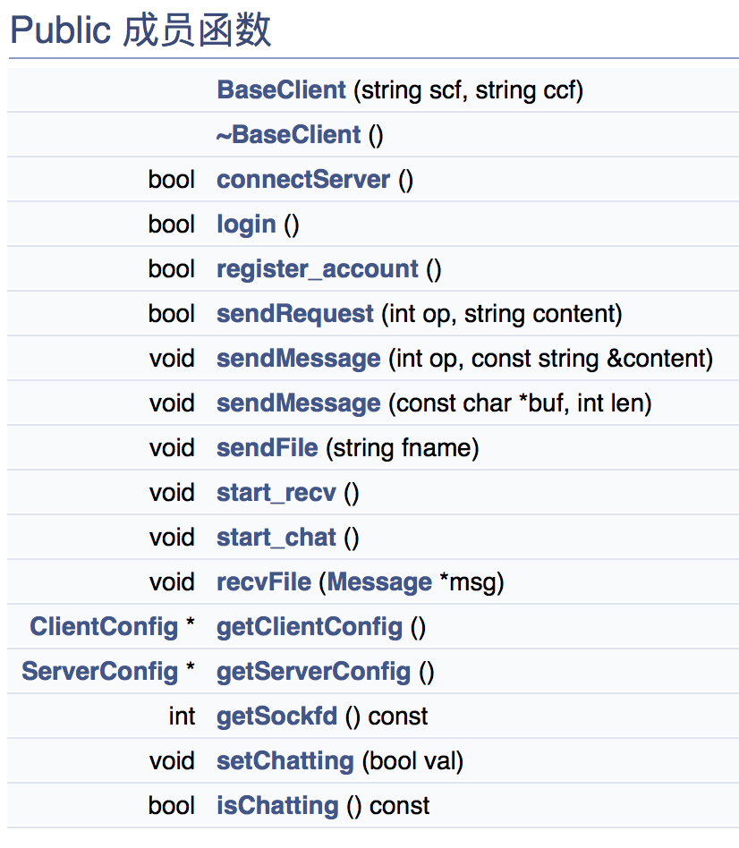
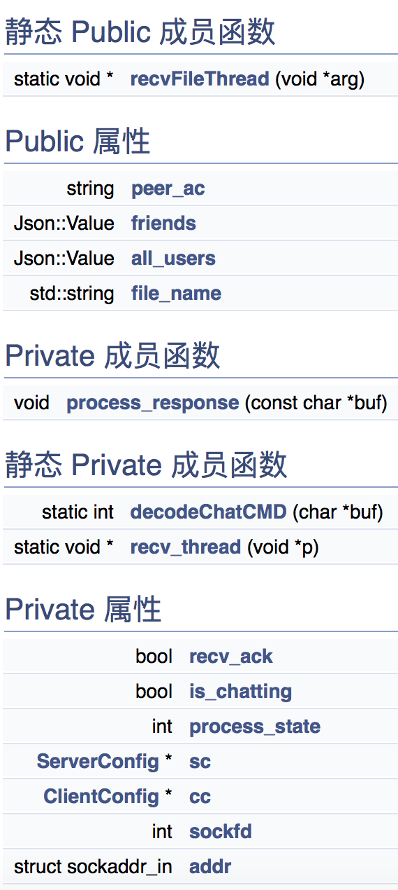
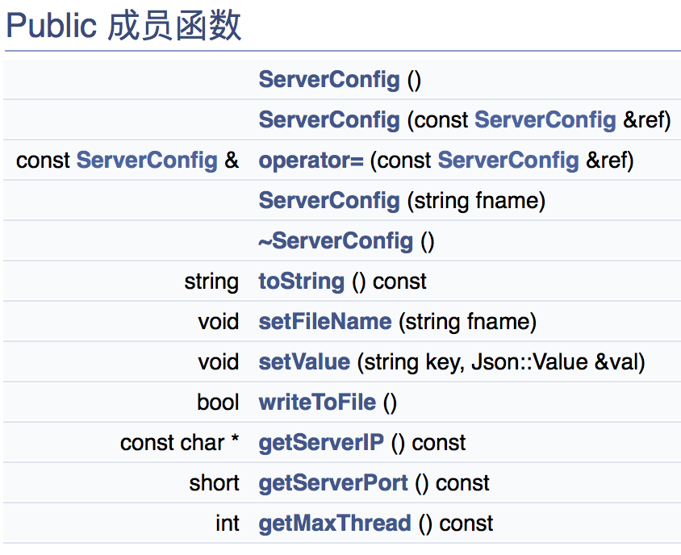
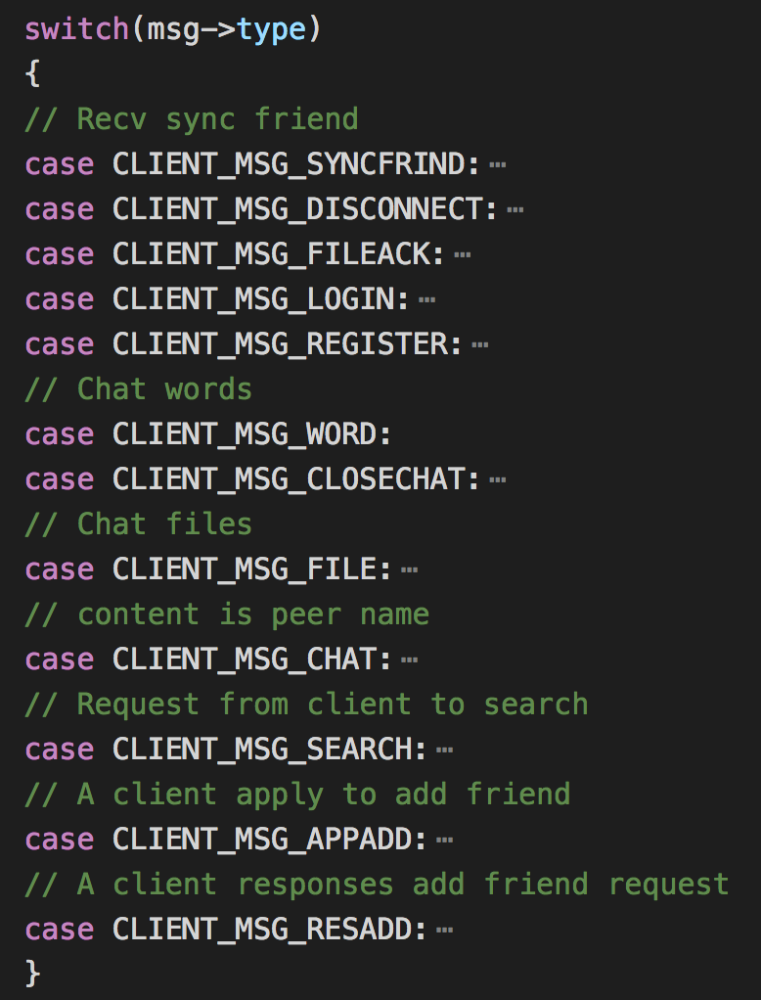
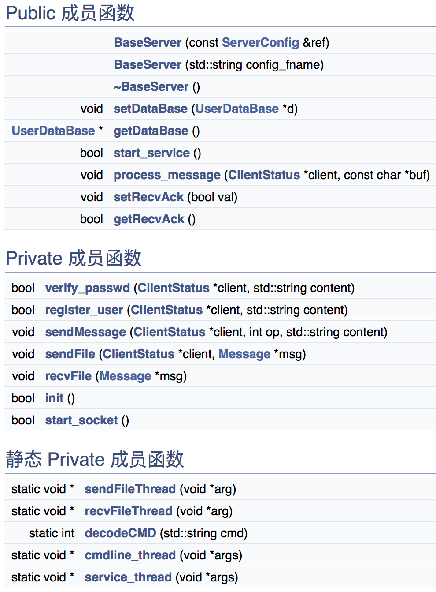
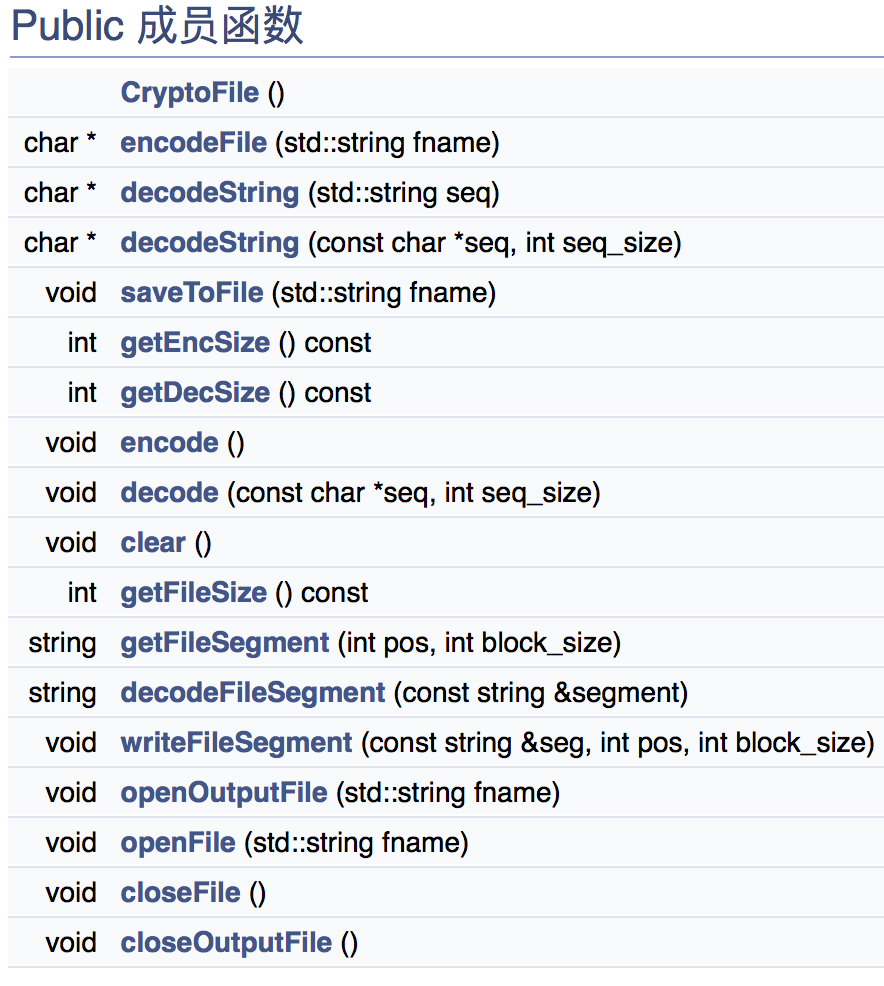

# 简易版微信 实验报告

##  2015011313 徐鉴劲 计54

## 实验目的与概述

本实验基于TCP传输开发一款及时通信类软件，要求基于C/S架构，只使用linux底层socket库，实现一个简易版的即时通信软件，包含及时聊天、文件传输、离线、接收消息等功能。

在本实验中我完成了命令行客户端和命令行服务端，完成了所有的基本要求（包括100M大文件传输）。实验中没有要求的功能点在本次实验中有：

1. 加好友的验证流程。

2. 服务端实时显示数据库状态的监控命令。

3. 本地端存储登录信息以快速登陆。

## 实验项目架构

### 数据库

`UserDataBase` 一个基于`Json`的简易数据库。通过用户名进行查找，记录了用户名、用户昵称、好友、在线状态、对话对象等。

完成的主要功能是用户查找，登陆验证，并可以通过Json在本地上进行存储和读取。

### 消息类型

我使用Json进行消息的转换。Json中记录了一些需要的信息，不同的消息类型具有不同的值需要填写，包括消息类型、消息内容等。
通过encode和decode进行消息的编码和解码。

### 客户端

1. `client/clientmain.cpp`是主程序所在位置。在一个大循环中进行连接、登陆、对话等状态的转换，调用`BaseClient`对应的接口实现。主要功能如下：

- 初始化`BaseClient`，连接服务器。

- 调用`BaseClient`的登陆接口。

- 登陆成功后调用`BaseClient`的`start_recv`开始接受来自服务端的反馈。

- 进入`serve`状态，识别各种命令：查找好友、同步信息，进行对话。

- 退出`serve`状态。

2. `ClientConfig`完成客户端基本配置，记录上次登陆信息等。

3. `BaseClient`实现了全部的通信功能。

- `login`向服务器发送Login信息并等待验证。

- 静态函数`recv_thread`中处理服务器返回的消息，并调用`process_response`进行处理。初始化的时候直接新建了一个线程，故不会被命令行阻塞掉。

- `process_response`中解码消息，根据收到消息的类型进行相应的处理：

### 服务器

1. 服务器主程序`server/servermain.cpp`：首先初始化数据库，然后初始化`BaseServer`，调用`BaseServer`类中的`start_service`函数。

2. `ServerConfig`通过Json记录了服务器的基本信息，以防每次修改基本数据后都要重新编译。

3. `BaseServer`

- `init`通过socket绑定端口并开始监听。

- `start_service`每当有一个连接请求到来就为其新建一个服务线程，调用静态函数`service_thread`。

- 每一个`service_thread`中有一个消息缓冲，通过一个阻塞式的接受等待消息，消息到来以后传给`process_message`进行处理。

- `process_message`中针对每一个消息进行不同的处理：

整个`BaseServer`架构如下：

## 文件传输实现

文件传输是本次实验中最为困难的一部分。我的实现方法是将二进制文件转化成64个可见字符进行编码，每次读取一段文件（4 KB）传输给服务器，服务器接受完以后再传输给另一方对话者。

其中我使用了`CryptoFile`类进行文件读取、编码解码的实现。对第三方库`CryptoCPP`进行封装，调用了它的编码、解码函数进行实现。

具体流程如下：（A向B发送文件）

1. A客户端按照一定位移读取文件。

2. A客户端编码文件片段。

3. A客户端填写消息类型，将文件片段发送给服务器。

4. 服务器收到文件片段，解码文件片段，删除原来的同名文件（如果有的话），将之（以追加模式）写入本地目录。

5. 服务器向客户端A发送Ack。

6. A客户端收到Ack，返回1，重复进行直至文件发送接受。

7. 服务器按照一定位移读取文件，编码文件片段，填写消息并向客户端B发送文件片段。

8. 客户端B收到消息，解码消息，解码文件片段，以追加模式写入本地目录。

9. 客户端B向服务器发送确认消息Ack。

10. 服务器收到B的Ack，回到7继续传输，直至结束。

## 思考题

1. Linux系统里，Socket与文件的关系是什么？

在 Linux 系统里，一切都是文件，而文件有个文件描述符，对文件描述符进行读写即能实现对文件的读写。

Socket是用一个类似文件系统实现的，对socket描述符进行读写，即能实现网络的读写。

2. 即时通信时，服务器程序的角色是什么？

服务器是转发的角色。
用户与对方通信时，不直接与对方建立连接，而是通过与服务器建立连接，将要发给对方的消息发给服务器，再由服务器转发给对方。

3. 服务器端口与客户端连接个数的关系是什么？

服务器端口与客户端连接个数并无直接的关系，每个客户端的连接使用的都是同一个端口，多个客户端连入不会增加端口号。
由于每一个客户端需要一个线程进行服务，实际上是系统能承受的最大线程数量决定了能够连接的客户端数量。实际中也有通过轮巡的方式减少线程消耗的服务器架构。

## 总结和收获

本次实验中，由于时间原因，我只完成了最基本的功能，但是在这其中也遇到了多重困难。

其中消耗我时间最多是多线程的问题，使用C++11的线程需要静态函数，我多次将this指针作为参数传递进静态函数中，十分不优美，并造成了许多错误。

其次是Json的读写。有一段时间我的程序经常接受不到完整的消息，而这是用Json进行解析时，程序会直接崩溃，给我的调试工作造成了极大的困难。

最后是文件传输功能的实现，我使用了较为简单的实现，并没有识别出包连接的情况，因此debug失败了很长时间。